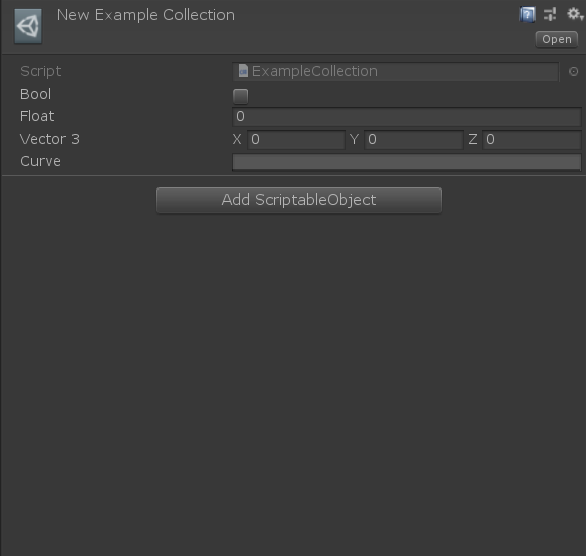
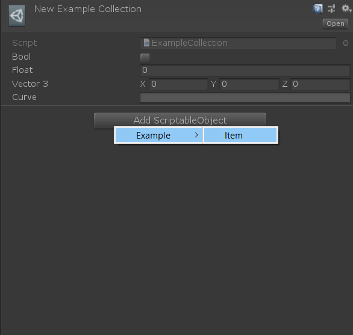
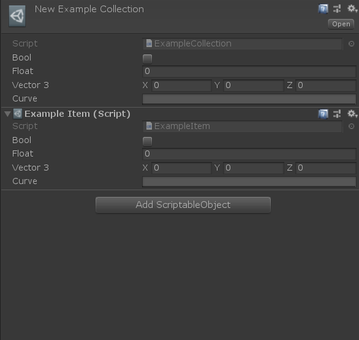
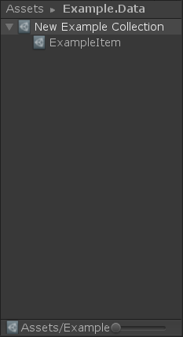
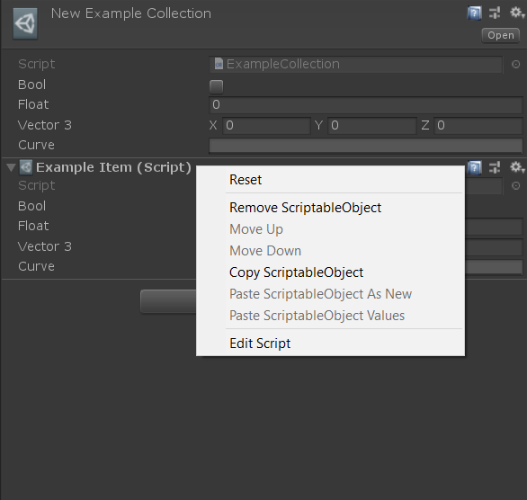
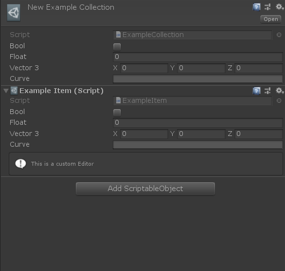
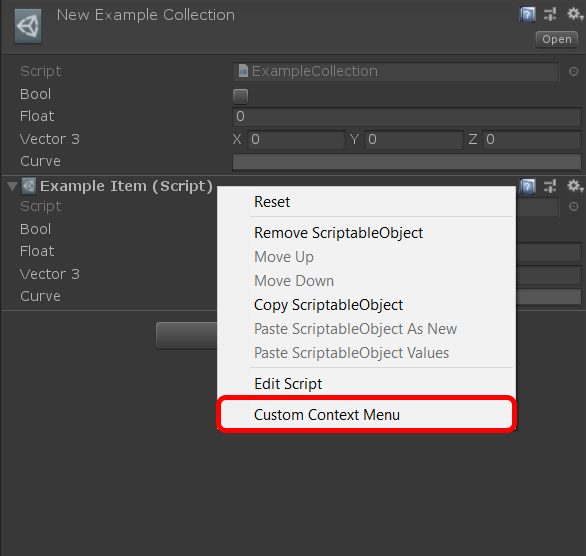

[< Back](../readme.md)

## Define And Work

Examples how to define and work with **ScriptableObjectCollection**.

### Define you custom collection

To define you custom collection you need to inherit from `ScriptableObjectCollection<T>`, where `T` is type of element in collection.

This is the code of example collection, with additional test fields.

```cs
using UGF.ScriptableObjectCollection.Runtime;
using UnityEngine;

namespace Example.Runtime
{
    [CreateAssetMenu(menuName = "Example/ExampleCollection")]
    public class ExampleCollection : ScriptableObjectCollection<ExampleItem>
    {
        [SerializeField] private bool m_bool;
        [SerializeField] private float m_float;
        [SerializeField] private Vector3 m_vector3;
        [SerializeField] private AnimationCurve m_curve;

        public bool Bool { get { return m_bool; } set { m_bool = value; } }
        public float Float { get { return m_float; } set { m_float = value; } }
        public Vector3 Vector3 { get { return m_vector3; } set { m_vector3 = value; } }
        public AnimationCurve Curve { get { return m_curve; } set { m_curve = value; } }
    }
}
```

This is the code of element of collection, with additional test fields.

```cs
using UGF.ScriptableObjectCollection.Runtime;
using UnityEngine;

namespace Example.Runtime
{
    [ScriptableObjectCollectionCreate("Example/Item")]
    public class ExampleItem : ScriptableObject
    {
        [SerializeField] private bool m_bool;
        [SerializeField] private float m_float;
        [SerializeField] private Vector3 m_vector3;
        [SerializeField] private AnimationCurve m_curve;

        public bool Bool { get { return m_bool; } set { m_bool = value; } }
        public float Float { get { return m_float; } set { m_float = value; } }
        public Vector3 Vector3 { get { return m_vector3; } set { m_vector3 = value; } }
        public AnimationCurve Curve { get { return m_curve; } set { m_curve = value; } }
    }
}
```

This is how it looks in inspector.

|  |
| :---: |
| The empty **ScriptableObjectCollection** in inspector |

You can add new element by pressing **Add ScriptableObject** button and choose it from dropdown menu.

> Note: the nicer context menu, which looks like **Add Component** menu, not implemented yet.

|  |
| :---: |
| Adding new element |

Now after adding new element, collection looks like this.

|  |
| :---: |
| The **ScriptableObjectCollection** with new element in inspector |

|  |
| :---: |
| The **ScriptableObjectCollection** in **Project** window |

Also there available the context menu for each element.

|  |
| :---: |
| The context menu of element |

### Custom Editor For Element

You still available to make you custom editor for each element.

```cs
using Example.Runtime;
using UnityEditor;
using UnityEngine;

namespace Example.Editor
{
    [CustomEditor(typeof(ExampleItem))]
    public class ExampleItemEditor : UnityEditor.Editor
    {
        public override void OnInspectorGUI()
        {
            DrawDefaultInspector();

            EditorGUILayout.HelpBox("This is a custom Editor", MessageType.Info);
        }
    }
}
```

Now it displaying in inspector.

|  |
| :---: |
| The custom editor in inspector |

### Custom Context Menu Items

Items in collection do not support any of user context menu, using **MenuItem** or **ContextMenu** attributes.
But you can add custom menu items through the implementation of **IHasCustomMenu** in custom **Editor** of your type.

```cs
using Example.Runtime;
using UnityEditor;
using UnityEngine;

namespace Example.Editor
{
    [CustomEditor(typeof(ExampleItem))]
    public class ExampleItemEditor : UnityEditor.Editor, IHasCustomMenu
    {
        public void AddItemsToMenu(GenericMenu menu)
        {
            menu.AddItem(new GUIContent("Custom Context Menu"), false, () => Debug.Log("Custom Context Menu Message"));
        }
    }
}
```

Now it will appears in context menu.

|  |
| :---: |
| The user defined context menu item |

---
> Unity Game Framework | Alexander Vorobyov | Copyright 2018